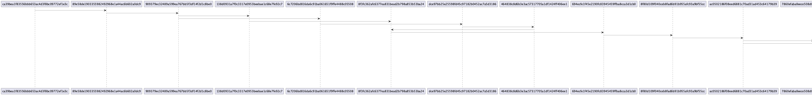

```markdown
# Dependency Visualizer

## Описание  
Этот проект предназначен для визуализации зависимостей в Git-репозиториях. Основная задача программы — построение диаграммы, отображающей историю коммитов, включая авторов, дату и связи между коммитами, с помощью PlantUML.  

Программа включает следующие основные функции:  
- Загрузка конфигурации из файла `config.json`.  
- Извлечение объектов Git, таких как коммиты и их содержимое.  
- Построение цепочек зависимостей между коммитами.  
- Генерация PlantUML-кода для визуализации.  
- Сохранение диаграммы в формате PNG.  

Для тестирования всех функций проекта предусмотрены модульные тесты с использованием `pytest`.

---

## Функции и настройки  

### Основные возможности  
1. **Загрузка конфигурации**  
   Конфигурационный файл `config.json` содержит параметры для работы программы:
   - `repo_path` — путь к репозиторию Git.
   - `branch_name` — имя ветки для анализа.
   - `visualization_path` — путь для сохранения промежуточных файлов визуализации.
   - `image_path` — путь для сохранения итогового изображения.  

2. **Чтение Git-объектов**  
   Программа считывает данные из объектов Git, таких как коммиты, с помощью декомпрессии и парсинга.  

3. **Построение истории коммитов**  
   История коммитов включает хэш, автора, дату и родительский коммит, что позволяет построить дерево зависимостей.  

4. **Генерация PlantUML**  
   На основе истории коммитов программа создает текстовый файл в формате PlantUML, который затем преобразуется в диаграмму.  

5. **Сохранение диаграммы**  
   Итоговая диаграмма сохраняется в формате PNG с помощью PlantUML.  

---

## Сборка проекта  


### Команды для работы с проектом  
1. **Запуск программы:**  
   ```bash
   python dependency_visualizer.py
   ```
   Для работы программы необходимо наличие корректного `config.json` в корневой директории.  

2. **Запуск тестов:**  
   ```bash
   pytest tests/test_dependency_visualizer.py
   ```

---

## Результаты тестирования  

Результаты успешного прогона тестов:  
```bash
$ pytest tests/test_dependency_visualizer.py
......
----------------------------------------------------------------------
Ran 6 tests in 0.05s

OK
```

---

## Пример конфигурационного файла  
Пример содержимого `config.json`:  
```json
{
    "repo_path": "/path/to/repository",
    "branch_name": "main",
    "visualization_path": "/path/to/visualization",
    "image_path": "/path/to/output/image.png"
}
```

---

## Пример использования  

### Пример работы программы  
После запуска скрипта диаграмма коммитов сохраняется в указанном в конфигурации пути. Пример итоговой визуализации:  



---

## Ссылка на репозиторий  
[GitHub Repository](https://github.com/riakkka/konfig.homeworks.git)
```